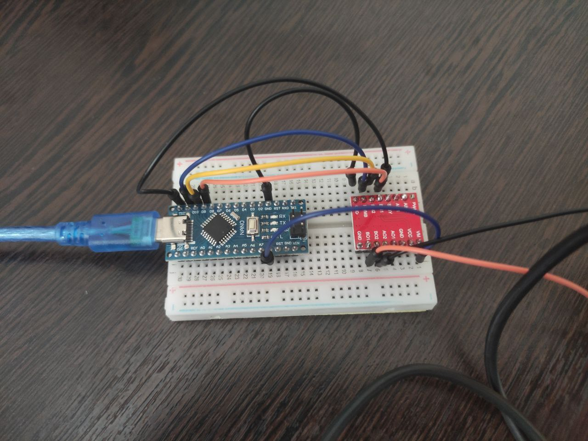

# Список компонентов для устройства

- Arduino Nano (для некоторых вариантов требуется установить драйвер CH340, также для программирования рекомендую использовать только Arduino IDE)
- мотор JGA-25-370 (DC 12V, 205rpm)
- драйвер мотора TB6612
- бредборд
- провода для бредборда
- веб-камера с креплением 1/4"

Схема подключения на фото ниже:

