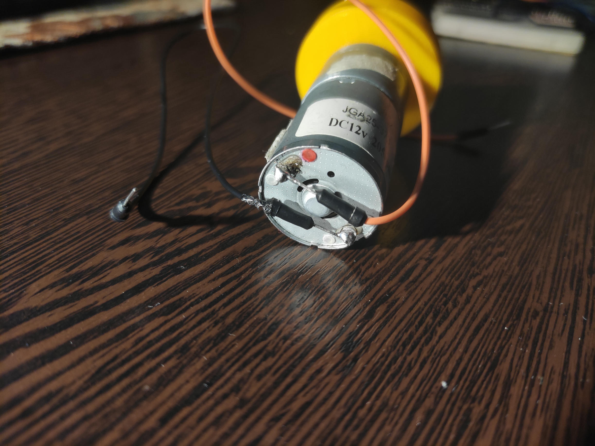
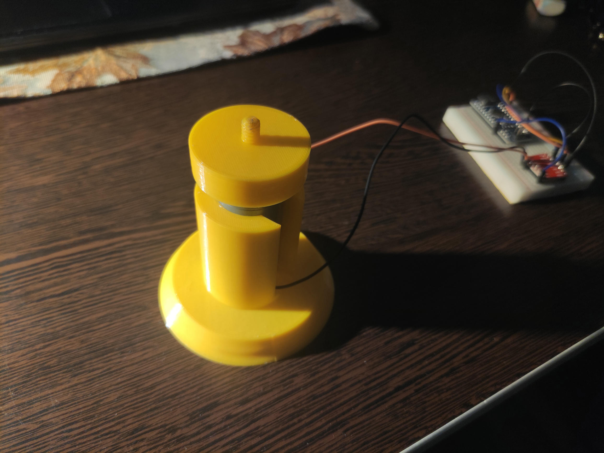

# Список компонентов для устройства

- Arduino Nano (для некоторых вариантов требуется установить драйвер CH340, также для программирования рекомендую использовать только Arduino IDE)
- мотор JGA-25-370 (DC 12V, 205rpm)
- драйвер мотора TB6612
- бредборд
- провода для бредборда
- веб-камера с креплением 1/4"

## Инструкция по сборке

1. Распечатать на 3d принтере .step файлы из `./src/freecad/`

2. Припаять к мотору проводки:

    

3. Собрать электронную составляющую. Схема подключения на фото ниже:

    

4. Собрать вокруг мотора распечатанные детали.

    

5. С помошью крепежа 4" установить на крышку корпуса камеру.

6. Подключить к компьютеру, на котором будет запущен скрипт.

Готово!
